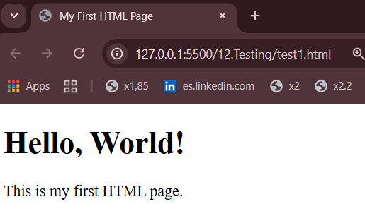
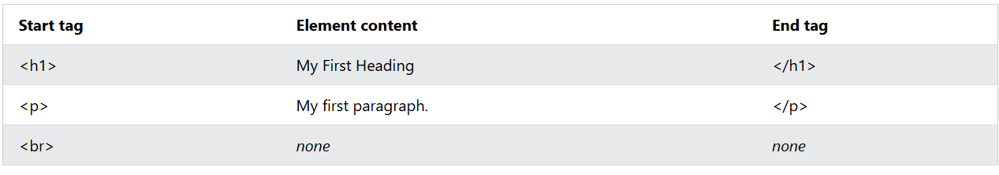
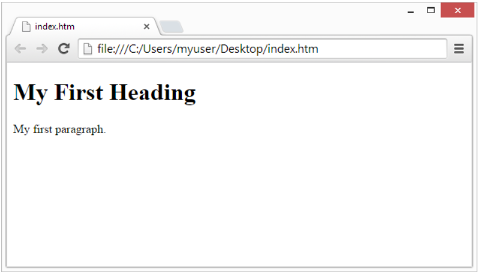

# Basics/HTML Introduction
---
## What is HTML?
- **HTML** stands for **Hyper** **Text** **Markup** **Language**
- HTML is the **standard** markup language for creating Web pages
- HTML describes the **structure** of a Web page
- HTML consists of a **series of elements**
- HTML elements **tell the browser how to display the content**
  - This means that, **based on the HTML code**, the **browser** will **know** **what** to **show** and **how** to **show** it.
- HTML elements label pieces of content such as "this is a heading", "this is a paragraph", "this is a link", etc.
  
--- 
## Reason of the standar name "index.html"
- The name **index.html** is a convention used to indicate the **default** **page** of a website or directory.
- A long time ago, when you entered in a website, the **server** would **look** **for** a file named **index.html** to display as the **homepage**.
- Like a **point of entry**, it serves as the **starting** **point** for users visiting a website.

--- 
## A Simple HTML Document 
- **Example of a simple HTML document:**
  ```html
  <!DOCTYPE html>
  <html>  
    <head>
      <title>My First HTML Page</title>
    </head>
    <body>
      <h1>Hello, World!</h1>
      <p>This is my first HTML page.</p>
    </body>
  </html>
  ```

- **Example Explained:**
  - The `<!DOCTYPE html>` declaration **defines** that **this** **document** **is an HTML5 document**
  - The `<html>` element is the **root element** of an **HTML page**
  - The `<head>` element **contains** **meta** **information** about the HTML page
  - The `<title>` element **specifies** a **title** for the HTML page
  - The `<body>` element **defines** the **document's body**
  - The `<h1>` element defines a **large heading**
  - The `<p>` element **defines a paragraph**

- **The code displayed in a web browser:**

  

--- 
## What is an HTML Element?
- An HTML element is **defined** by a **start tag**, **some content**, and **an end tag**:
  ```html
  <tagname> Content goes here... </tagname>
  ```
- The **HTML** **element** is **everything** **from** the **start** **tag** **to** the **end** **tag**
- **Examples:**
  ```html
  <h1>My First Heading</h1>
  <p>My first paragraph.</p>
  <br>
  ```
  

> Note: Some HTML elements do not have an end tag. These are called **self-closing** or  **void** or **empty** elements. 
> For example, the **`<br>`** element is used to insert a line **break** and does not require an end tag.

--- 
## Web Browsers
- The **purpose** of a web browser (Chrome, Edge, Firefox, Safari) is to **read** **HTML** documents and **DISPLAY** **them** **correctly**.
- A browser does **not display the HTML tags**, but **uses** **them** to **determine** **HOW** to **display** the **document**
- **Example:**
  
- **Different** **browsers** may display the **same** **HTML** document **differently**, but they all **follow** the **same** **basic** **principles** of HTML rendering. 
- Browsers also have their own **default styles** for HTML elements, which can lead to variations in appearance.

---
## HTML Page Structure
- Below is a **visualization** of an HTML page structure:
  
> Note:
> The content inside the **`<body>`** tag is what is **visible** on the web page, while the content inside the **`<head>`** tag is used for **meta-information** and is not displayed directly on the page.