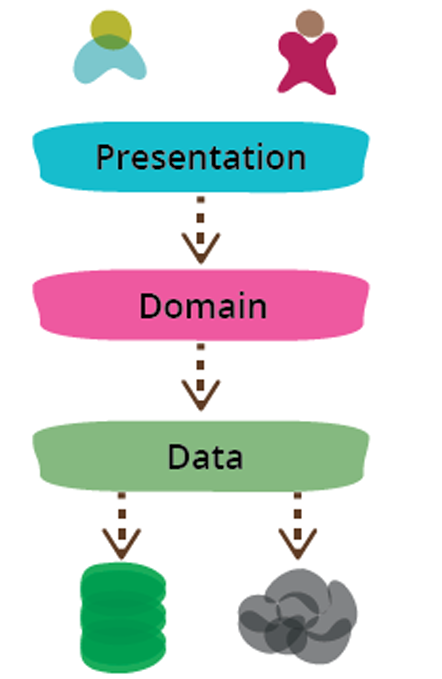

# Architecture

> This file contains a brief overview of software architecture styles, focusing on **Monolithic**, **Microservices**, and **Hexagonal** architectures.  
> The goal is to have the main concepts and only the most important details for backend development.  
> Deeper details will be covered in the subject *Information Systems Design (DSI)*.


## Monolithic

A **Monolithic Architecture** is a single deployable application containing all modules.  
It’s simple to build and run, but can become harder to maintain and scale as the system grows.

### Layered Architecture Style
- The system is organized into **layers**, each with a specific responsibility.
- Each layer can only interact with the layer directly below it.
- Common layers:
  - **Presentation Layer (UI):** HTML, CSS, JS.
  - **Business Logic Layer (BLL):** Services and controllers.
  - **Data Access Layer (DAL):** Repositories.
  - **Database Layer (DB):** SQL / NoSQL.
- Image of the layered architecture:  
  

**Typical backend structure**
```plaintext
src/src/
└─ main/java/com/acme/app/
├─ controller/ # HTTP endpoints, DTOs
├─ service/ # business logic, orchestration
├─ repository/ # persistence layer
└─ model/ # domain entities
```


---

### SOA (Service-Oriented Architecture)
- **Idea:** services grouped by business domains (Users, Orders, Payments), often **inside one monolith**.  
- Focused on **interoperability** via XML, SOAP, or HTTP.  
- Services are coarse-grained and often share infrastructure.

**Why relevant?**  
- SOA was the **catalyst** for Microservices: it introduced the service mindset, but Microservices extended it with **independent deployment, lighter protocols (REST/events), and team autonomy**.

---

## Microservices

A **Microservices Architecture** splits the system into **independently deployable services**, each owning its own data and lifecycle.  
Communication happens via HTTP APIs or async messaging.

**Key characteristics**
- Independence: each service is its own unit.
- Communication: REST APIs, gRPC, events/queues.
- Scalability: scale only the service that needs it.
- Resilience: failure in one service doesn’t crash the whole system.
- Flexibility: each service can use different technologies.

**When to choose**
- ✅ Multiple teams.  
- ✅ High scalability.  
- ✅ Clear bounded contexts.  
- ❌ Not ideal for small/simple apps (too complex to start).


## Hexagonal (Ports & Adapters)

Also called **Ports & Adapters**.  
Goal: keep the **domain core isolated** from frameworks, DBs, or external APIs.

- **Ports:** interfaces the domain defines (e.g., `UserRepository`, `PaymentGateway`).  
- **Adapters:** implementations of those ports (JPA repo, REST client, MQ consumer, CLI).  
- **Inbound adapters:** how the world calls the app (HTTP controller, CLI, gRPC).  
- **Outbound adapters:** how the app calls the world (DB, external APIs, MQ).  

**Benefits**
- Domain stays testable and independent.  
- Easy to swap DB, frameworks, or APIs.  
- Clean separation of business vs. infrastructure code.

**Sketch**
```plaintext
          +-------------------+
          |   Inbound Adapter  |<-- e.g., HTTP Controller
          +-------------------+
                    |
                    v
          +-------------------+
          |       Port        |<-- e.g., UserService interface
          +-------------------+
                    |
                    v
          +-------------------+
          |   Domain Core     |<-- business logic, entities
          +-------------------+
                    |
                    v
          +-------------------+
          |      Port         |<-- e.g., UserRepository interface
          +-------------------+
                    |
                    v
          +-------------------+
          |  Outbound Adapter |<-- e.g., JPA Repository, REST Client
          +-------------------+
``` 


## SOA vs Microservices (Essentials)

- **SOA:**  
  - Service orientation inside a monolith.  
  - Coarse-grained services, shared infra.  
  - Heavy protocols (SOAP/XML).  

- **Microservices:**  
  - Independently deployable services.  
  - Fine-grained, own DB per service.  
  - Lightweight protocols (REST/JSON, events).  

---

## Monolith vs Microservices (Decision Checklist)

- **Choose Monolith** if:  
  - One team, low traffic, need speed, simpler ops.  
  - Boundaries not clear yet.  

- **Choose Microservices** if:  
  - Multiple teams, varied scaling needs.  
  - Clear domains, strong CI/CD and monitoring.  
  - Need independent deployments.  

---
# Spring Cloud Basics (Summary)

## Config Server
- Centralizes configuration for all microservices.  
- Configs stored in Git (YAML/Properties).  
- Services fetch configs at startup (or refresh).  
- ✅ Single source of truth, easy updates, environment profiles.  

## Eureka (Service Discovery)
- Registry where microservices **register** themselves.  
- Other services **discover** them dynamically (no hardcoded IPs/ports).  
- ✅ Supports load balancing, scaling, and fault tolerance.  

## Example (PetClinic)
- Config Server stores DB/API configs for **Customers, Visits, Vets**.  
- Eureka lets Visits find Customers without knowing its address.  
- Together: centralized **config + discovery** = scalable and flexible system.  

# Monitoring & Observability in Microservices

## Spring Boot Admin Server
- Central dashboard to **monitor microservices**.  
- Shows health status, logs, and metrics.  
- ✅ Simplifies admin tasks by centralizing monitoring in one UI.  

## Zipkin (Distributed Tracing)
- Collects and visualizes **distributed traces** across microservices.  
- Tracks how a request flows through multiple services.  
- Works with tools like Prometheus/Grafana.  
- ✅ Crucial for observability → helps debug errors and find performance bottlenecks.  


---
## CONCEPTS
### Resilience
- The resilience of a system is its ability to handle and recover from failures, ensuring continuous operation and minimal disruption to users.
- Key strategies for building resilience include redundancy, failover mechanisms, and graceful degradation.
- Techniques such as circuit breakers, bulkheads, and retries help manage failures in distributed systems.

